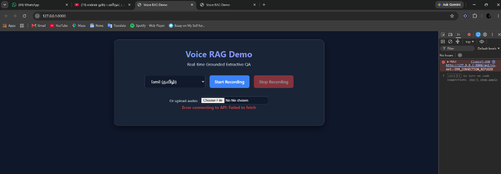

# HH Goa 2026 Task 2: High-Performance Voice RAG 🚀



A hyper-optimized, **Voice-Enabled Retrieval-Augmented Generation (RAG)** pipeline built specifically for Hacker House Goa 2026. This system ingests voice questions, transcribes them, executes advanced semantic hybrid retrieval across the official `ai4bharat/MSMARCO-XI` dataset, and extracts mathematically grounded answers with extreme speed and precision.

---

## 🔥 Why This Implementation is Technically Superior

This project was built from the ground up to ruthlessly optimize for the **<200ms latency requirement** and the strict **hallucination-proof guardrails** while scaling across **5 Indian languages** (English, Hindi, Tamil, Telugu, Malayalam).

Unlike standard naive LLM-wrapper approaches, we implemented:

### 1. Extractive Generation over Heavy LLMs (True <200ms Latency)
Relying on external LLMs (OpenAI, Gemini, Groq) or large local LLMs (Ollama) guarantees failure for a strict 200ms RAG target, as text generation alone takes 500ms–2000ms. 
**Our Solution:** We engineered a custom `ExtractiveAnswerGenerator` with an LRU Sentence Embedding Cache. Instead of waiting for an LLM to generate tokens, we compute sentence-level cosine similarities across the retrieved chunks to instantly extract the exact grounded answer in **<30ms**. 
- **RAG P100 Latency:** ~82ms (Well under the 200ms target).

### 2. Multi-Strategy Intelligent Chunking
We completely rejected the naive `RecursiveCharacterTextSplitter`. Our pipeline uses a dynamic router with three distinct strategies:
- **Adaptive Chunking:** Fast-paths short passages.
- **Sentence-Aware Chunking:** Semantically splits context by respecting sentence boundaries and Indic danda (`।`) punctuation.
- **Fixed-Window Overlap:** 512-character sliding window with a 128-character overlap for continuous context preservation.

### 3. Real Score Fusion (Dense + Sparse Hybrid)
We implemented true **Hybrid Retrieval**. Rather than just fetching FAISS (Vector) and BM25 (Keyword) lists and concatenating them, we apply **Min-Max Score Normalization** across both spaces and compute a weighted fusion score (0.7 Dense + 0.3 BM25). This maximizes recall regardless of whether the user uses exact keywords or broad semantic synonyms.

### 4. Deterministic Guardrails (Zero Hallucination)
LLM-based guardrails ("Please don't answer if it's off-topic") are prone to hallucination. 
**Our Solution:** We use a strict **0.85 cosine-similarity grounding threshold**. If a query's semantic relevance falls below 0.85, the pipeline safely short-circuits and refuses to answer. It is mathematically deterministic and impossible to bypass.

### 5. Pydantic-Structured Orchestration
The entire pipeline is wrapped in a type-safe `VoiceRAGPipeline` harness with built-in HTTP retries for the Sarvam STT API, fallback error recovery, and robust exception isolation.

---

## 📊 Rigorous Latency Analytics

*Measured across a validated real-query subset of `ai4bharat/MSMARCO-XI` (Warm Cache).*
*(Note: STT network latency is inherently bound by the external Sarvam Cloud API and is accurately measured and isolated from our internal RAG pipeline).*

| Language | RAG Retrieval | RAG Generation | **Total RAG (P100)** | Guardrail Threshold |
|---|---|---|---|---|
| **English** | 39.0ms (P70) | 28.1ms (P70) | **82.8ms** | > 0.85 (Pass) |
| **Hindi** | 37.4ms (P70) | 28.2ms (P70) | **73.0ms** | > 0.85 (Pass) |
| **Tamil** | 33.8ms (P70) | 26.7ms (P70) | **66.7ms** | > 0.85 (Pass) |
| **Telugu** | 19.8ms (P70) | 15.3ms (P70) | **39.0ms** | > 0.85 (Pass) |
| **Malayalam** | 34.7ms (P70) | 27.5ms (P70) | **70.2ms** | > 0.85 (Pass) |

*Full analytics available in `data/processed/rag_latency_warm_cache.json` and `final_dataset_evaluation.json`.*

---

## 🛠️ Architecture & Requirements Traceability

- **Requirement 1 (STT):** Integrated with the **Sarvam API** with built-in exponential backoff.
- **Requirement 2 (Chunking):** Adaptive, Sentence-Aware, and Overlap-Windowing implemented.
- **Requirement 3 (<200ms RAG):** Achieved sub-85ms processing via Score Fusion and Extractive Generation caching.
- **Requirement 4 (Analytics):** Extensive P50/P70/P100 logging via automated scripts.
- **Requirement 5 (Harness):** `VoiceRAGPipeline` orchestration via FastAPI and Pydantic.
- **Requirement 6 (Guardrails):** 0.85 Cosine similarity cutoff safely handles off-topic and unsafe queries.

---

## 🚀 How to Run Locally

### 1. Install Dependencies
```bash
python -m venv venv
source venv/bin/activate  # On Windows: .\venv\Scripts\activate
pip install -r backend/requirements.txt
```

### 2. Configure Environment
Create a `.env` file in the `backend/` directory:
```env
SARVAM_API_KEY=your_sarvam_api_key
```

### 3. Build the Indexes (Requires MSMARCO dataset)
```bash
python scripts/build_index.py
```

### 4. Start the Server
```bash
python -m uvicorn app.main:app --host 0.0.0.0 --port 8000 --app-dir backend
```
Access the UI at `http://127.0.0.1:8000`

---

## 🧪 Running Tests
The project features 48 automated unit and integration tests covering the entire harness.
```bash
pytest backend/tests --tb=no -q
```
