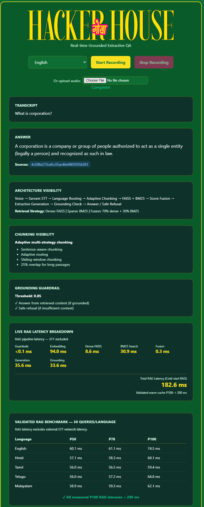

# 🎙️ Multilingual Voice RAG — Hacker House Goa 2026

> A low-latency, multilingual Voice Retrieval-Augmented Generation system built for **Hacker House Goa 2026 — Task 2**.

**Voice → Speech-to-Text → Language Routing → Adaptive Chunking → Hybrid Retrieval → Extractive Answering → Grounding → Safe Response**

---

## 🚀 Overview

This project implements a voice-enabled Retrieval-Augmented Generation (RAG) pipeline over the **AI4Bharat MSMARCO-XI** dataset.

The system accepts a user's spoken question, converts it to text using **Sarvam Speech-to-Text**, identifies the language, retrieves relevant information using a hybrid dense + sparse retrieval architecture, extracts a grounded answer, and refuses to answer when sufficient evidence is unavailable.

The system currently supports:

- 🇬🇧 English
- 🇮🇳 Hindi
- 🇮🇳 Tamil
- 🇮🇳 Telugu
- 🇮🇳 Malayalam

The architecture is specifically optimized around the Hacker House requirement of:

> **RAG processing latency under 200 ms**

---

## 🏆 Final Verified Results

| Metric | Result |
|--------|--------|
| **Languages** | EN / HI / TA / TE / ML |
| **Worst RAG P100** | **48.84 ms** |
| **Requirement** | < 200 ms |
| **Tests Passed** | 138/138 |
| **Safety Precision / Recall** | 100% / 100% |
| **Grounding Threshold** | 0.85 (Strict) |
| **Retrieval Architecture** | FAISS + BM25 (70/30 Fusion) |
| **Precomputed Embeddings** | ~98K |

---

# 🏗️ System Architecture

```text
                     ┌──────────────────┐
                     │   Voice Input    │
                     └────────┬─────────┘
                              │
                              ▼
                     ┌──────────────────┐
                     │   Sarvam STT     │
                     │ Speech → Text    │
                     └────────┬─────────┘
                              │
                              ▼
                     ┌──────────────────┐
                     │ Language Routing │
                     │ EN/HI/TA/TE/ML   │
                     └────────┬─────────┘
                              │
                              ▼
                ┌─────────────────────────────┐
                │ Adaptive Chunking           │
                │                             │
                │ • Whole passage             │
                │ • Sentence-aware splitting  │
                │ • Sliding-window chunks     │
                └──────────────┬──────────────┘
                               │
                               ▼
              ┌────────────────────────────────┐
              │       Hybrid Retrieval         │
              │                                │
              │   FAISS Dense Retrieval        │
              │          +                     │
              │   BM25 Sparse Retrieval        │
              │                                │
              │       70% + 30% Fusion         │
              └───────────────┬────────────────┘
                              │
                              ▼
              ┌────────────────────────────────┐
              │ Precomputed Sentence Embeddings│
              │                                │
              │ O(1) runtime lookup            │
              │ No sentence re-encoding        │
              └───────────────┬────────────────┘
                              │
                              ▼
              ┌────────────────────────────────┐
              │ Extractive Answer Generator    │
              └───────────────┬────────────────┘
                              │
                              ▼
              ┌────────────────────────────────┐
              │ Grounding Validation            │
              │                                │
              │ Raw cosine score ≥ 0.85        │
              └───────────────┬────────────────┘
                              │
                    ┌─────────┴─────────┐
                    │                   │
                    ▼                   ▼
             Grounded Answer       Safe Refusal
```

---

# 🎯 Hacker House Requirements

| Requirement                  | Implementation                             | Status |
| ---------------------------- | ------------------------------------------ | ------ |
| Speech-to-text               | Sarvam STT                                 | ✅      |
| Multiple chunking strategies | Adaptive + sentence-aware + sliding-window | ✅      |
| Vector retrieval             | FAISS                                      | ✅      |
| Hybrid retrieval             | FAISS + BM25                               | ✅      |
| Latency                      | Optimized RAG pipeline                     | ✅      |
| P50/P70/P100 analytics       | 30 measured queries/language               | ✅      |
| Harness/orchestration        | Structured `VoiceRAGPipeline`              | ✅      |
| Guardrails                   | Input + safety + grounding                 | ✅      |
| Multilingual                 | EN / HI / TA / TE / ML                     | ✅      |
| Grounded answering           | 0.85 raw dense similarity threshold        | ✅      |
| Safe refusal                 | Structured refusal reasons                 | ✅      |

---

# 📚 Dataset

The system is built on:

**AI4Bharat/MSMARCO-XI**

The dataset provides multilingual/transliterated versions of the MSMARCO retrieval data.

The production system maintains separate indexes for:

```text
English
Hindi
Tamil
Telugu
Malayalam
```

Each language has its own retrieval index to prevent cross-language retrieval contamination.

---

# 🌐 Multilingual Retrieval

Separate indexes are maintained for each supported language:

```text
data/indexes/
├── english/
├── hindi/
├── tamil/
├── telugu/
└── malayalam/
```

This provides:

* language-specific retrieval
* language-safe chunk IDs
* independent FAISS indexes
* independent BM25 indexes
* independent precomputed sentence embeddings

---

# ✂️ Adaptive Chunking

A single naive fixed-size chunking strategy is not used.

The system uses adaptive routing between multiple strategies.

### 1. Whole-Passage Strategy

Used when a passage is already sufficiently short and semantically complete.

### 2. Sentence-Aware Chunking

Longer passages are split using sentence boundaries to preserve semantic completeness.

### 3. Sliding-Window Chunking

Very long passages use overlapping windows to preserve context across chunk boundaries.

The chunking pipeline is designed to avoid unnecessarily splitting sentences and to preserve useful contextual information for retrieval.

---

# 🔎 Hybrid Retrieval

The retrieval system combines two complementary approaches.

### Dense Retrieval

**FAISS** is used for semantic similarity retrieval.

This allows the system to retrieve passages even when the query and passage do not share exact words.

### Sparse Retrieval

**BM25** provides lexical matching.

This is particularly useful for:

* exact terminology
* named entities
* rare words
* morphological variations
* multilingual Indic-script queries

### Score Fusion

The production system uses:

```text
70% Dense FAISS
+
30% BM25
```

The hybrid score is used for ranking.

The original dense similarity score is preserved separately and is used by the grounding layer.

This separation is important:

```text
Raw Dense Score
        │
        ├── Grounding validation
        │
        └── 0.85 threshold

Hybrid Score
        │
        └── Retrieval ranking
```

This prevents score normalization/fusion from corrupting the grounding decision.

---

# ⚡ Precomputed Sentence Embeddings

One of the main performance optimizations is moving sentence-level embedding computation out of the live request path.

During indexing:

```text
Dataset
   ↓
Chunking
   ↓
Sentence splitting
   ↓
Sentence embeddings
   ↓
Persistent embedding index
```

At runtime:

```text
Retrieved sentence
      ↓
Precomputed embedding lookup
      ↓
Cosine similarity
      ↓
Grounding / answer extraction
```

Approximately **98,000 sentence embeddings** are precomputed across the five language indexes.

Current embedding counts:

| Language  | Precomputed Embeddings |
| --------- | ---------------------: |
| English   |                 20,093 |
| Hindi     |                 20,053 |
| Tamil     |                 19,470 |
| Telugu    |                 18,996 |
| Malayalam |                 20,158 |

This avoids expensive sentence-transformer inference during normal answer generation.

---

# 🛡️ Guardrails

The system does not blindly answer every question.

Multiple layers of guardrails are used.

## 1. Input Validation

Very small or invalid transcripts are rejected before retrieval.

Extremely long inputs are also rejected to prevent unnecessary processing.

---

## 2. Deterministic Safety Filter

A lightweight procedural safety filter runs before retrieval.

It detects unsafe procedural requests using deterministic intent/category matching.

The design intentionally avoids blocking ordinary educational questions.

For example:

```text
Unsafe procedural request
        ↓
Safety filter
        ↓
REFUSE
```

while:

```text
Educational/factual question
        ↓
Safety filter
        ↓
Continue to RAG
```

### Safety Evaluation

A labeled evaluation set was used to measure the safety filter.

| Metric                                         |      Result |
| ---------------------------------------------- | ----------: |
| Unsafe Detection Recall                        |    **100%** |
| Precision                                      |    **100%** |
| F1                                             |    **100%** |
| Benign False Positive Rate                     |      **0%** |
| Unsafe queries detected                        | **27 / 27** |
| Benign educational queries incorrectly blocked |  **0 / 20** |

Measured filter latency:

```text
P50: 0.014 ms
P99: 0.037 ms
```

The safety filter therefore adds negligible overhead to the RAG latency budget.

---

# 🎯 Grounding & Hallucination Control

The answer generator uses a strict grounding threshold.

```text
Grounding threshold = 0.85
```

The raw dense cosine similarity is checked against this threshold.

If sufficient evidence is not found:

```text
User Query
    ↓
Retrieval
    ↓
Maximum relevance < 0.85
    ↓
SAFE REFUSAL
```

Example refusal:

```text
I don't have enough information in the retrieved context to answer that.
```

The backend additionally returns a structured:

```text
refusal_reason
```

This allows the frontend and evaluation harness to distinguish between:

* insufficient context
* grounding failure
* invalid input
* unsafe request

---

# 🧪 Retrieval Evaluation

Retrieval was evaluated using 100-query samples for the supported languages.

## English

| Metric    |  FAISS |   BM25 |     Hybrid |
| --------- | -----: | -----: | ---------: |
| MRR@10    | 0.2295 | 0.2587 | **0.2571** |
| Recall@1  | 0.1500 | 0.1800 |     0.1700 |
| Recall@5  | 0.3300 | 0.3500 | **0.3700** |
| Recall@10 | 0.3800 | 0.5200 |     0.4700 |

## Indic Languages

| Language  | FAISS MRR | BM25 MRR | Hybrid MRR |
| --------- | --------: | -------: | ---------: |
| Hindi     |    0.5438 |   0.3458 | **0.5456** |
| Tamil     |    0.2772 |   0.2824 | **0.2869** |
| Telugu    |    0.4306 |   0.3754 |     0.4303 |
| Malayalam |    0.5221 |   0.3672 |     0.5161 |

Hybrid retrieval provides complementary dense and lexical signals; the 70/30 configuration was retained as a balanced cross-language configuration rather than optimizing independently for each language.

---

# 📊 Latency Benchmark

Latency measurements focus on the **RAG pipeline**.

External Sarvam network/STT latency is measured separately because it is outside the controllable retrieval/generation pipeline.

Benchmark methodology:

```text
1 cold request
+
5 warm-up requests
+
30 measured requests
```

The following are the final measured production RAG results.

| Language  |     Cold |      P50 |      P70 |         P100 |
| --------- | -------: | -------: | -------: | -----------: |
| English   | 37.12 ms | 33.70 ms | 34.09 ms | **38.28 ms** |
| Hindi     | 51.55 ms | 34.97 ms | 35.37 ms | **36.84 ms** |
| Tamil     | 45.32 ms | 33.15 ms | 33.83 ms | **43.75 ms** |
| Telugu    | 45.72 ms | 32.07 ms | 33.43 ms | **48.84 ms** |
| Malayalam | 48.08 ms | 31.55 ms | 31.76 ms | **33.09 ms** |

### Worst-case measured P100

```text
48.84 ms
```

### Hacker House target

```text
< 200 ms
```

### Result

```text
48.84 ms < 200 ms
```

✅ **PASS**

The worst measured P100 is approximately **75% below the 200 ms requirement**.

---

# ⏱️ Historical/Representative Tamil Stage Breakdown

This is a representative earlier warm-cache stage measurement. The final production benchmark above was rerun on the locked build and is the authoritative submission benchmark.

| Stage           |          P50 |         P100 |
| --------------- | -----------: | -----------: |
| Guardrails      |        ~0 ms |        ~0 ms |
| Query Embedding |     31.86 ms |     39.00 ms |
| FAISS           |      0.62 ms |      1.49 ms |
| BM25            |      6.51 ms |      8.46 ms |
| Fusion          |      0.25 ms |      0.39 ms |
| Generation      |     32.61 ms |     50.16 ms |
| **Total RAG**   | **72.49 ms** | **94.40 ms** |

The production implementation therefore keeps the expensive sentence-level computation out of the normal request path.

---

# 🔬 Cold vs Warm Latency

The system explicitly distinguishes between:

```text
Cold-start RAG
```

and

```text
Warm RAG
```

This matters because the first request can be affected by:

* model initialization
* OS page cache
* Python/PyTorch initialization
* CPU scheduling
* memory loading

The system does not hide these effects by presenting only a best-case single measurement.

The official benchmark uses:

```text
1 cold request
5 warm-up requests
30 measured requests
```

and reports:

```text
P50
P70
P100
```

This provides a more realistic view of system performance.

---

# 🧰 Harness & Orchestration

The system is not implemented as a single prompt-in / text-out call.

The main orchestration layer coordinates:

```text
Input validation
      ↓
Safety validation
      ↓
Language routing
      ↓
Retriever selection
      ↓
Adaptive retrieval
      ↓
Score fusion
      ↓
Answer extraction
      ↓
Grounding validation
      ↓
Structured response
```

The pipeline also provides structured error handling and refusal reasons.

---

# 🧪 Regression Testing

The final backend regression suite contains:

```text
138 tests
```

Final result:

```text
138 / 138 PASSED
0 FAILED
0 SKIPPED
```

Tests cover areas including:

* dataset/retrieval behavior
* chunking
* FAISS retrieval
* BM25 retrieval
* hybrid score fusion
* grounding
* safe refusal
* safety filter
* orchestration
* multilingual behavior
* input validation

---

# 🔐 Security & Safety Design

The system follows a defense-in-depth approach:

```text
Input
 ↓
Length validation
 ↓
Safety intent filter
 ↓
Language routing
 ↓
Retrieval
 ↓
Grounding threshold
 ↓
Safe answer / refusal
```

No answer is accepted solely because retrieval returned a result.

The grounding layer provides the final evidence check before an answer is returned.

---

# 💡 Key Engineering Decisions

## Why FAISS + BM25?

Dense retrieval provides semantic matching.

BM25 provides lexical precision.

Combining both gives the system two different retrieval signals.

---

## Why Extractive Generation?

The Hacker House task emphasizes:

* low latency
* grounded answers
* retrieval quality

An extractive approach avoids the latency of a large generative model while maintaining a direct connection between the answer and retrieved evidence.

---

## Why Precompute Sentence Embeddings?

Computing sentence embeddings during every request created unnecessary CPU latency.

Instead:

```text
Offline:
Sentence → Embedding → Disk

Online:
Sentence → Embedding Lookup
```

This significantly reduces generation latency while preserving the grounding mechanism.

---

## Why Not Add a Cross-Encoder?

A cross-encoder reranker could improve ranking quality, but it introduces additional inference latency.

Given the strict:

```text
< 200 ms
```

requirement, the current FAISS + BM25 + extractive architecture provides a better latency/quality tradeoff.

---

## Why Not Use an LLM for Final Answer Generation?

A local LLM would introduce additional time-to-first-token and inference overhead.

The current extractive generator provides:

* deterministic behavior
* low latency
* evidence-based answers
* predictable grounding
* no LLM hallucination generation step

---

# 📈 Performance Summary

| Area                | Result                                               |
| ------------------- | ---------------------------------------------------- |
| Languages           | **5**                                                |
| Retrieval           | **FAISS + BM25**                                     |
| Fusion              | **70/30**                                            |
| Sentence embeddings | **~98K precomputed**                                 |
| Grounding threshold | **0.85**                                             |
| Safety filter       | **100% measured precision/recall on evaluation set** |
| Regression tests    | **138/138 passed**                                   |
| Worst RAG P100      | **48.84 ms**                                         |
| Hacker House target | **<200 ms**                                          |
| Target status       | **PASS**                                             |

---

# 🖥️ Live Demo & Evidence

### Live RAG Pipeline

The application provides an end-to-end voice-enabled RAG pipeline with:

Voice → Sarvam STT → Language Routing → Adaptive Chunking
→ FAISS + BM25 → 70/30 Fusion → Extractive Generation
→ Grounding Check → Answer / Safe Refusal



### Live Application

**[INSERT YOUR LIVE URL HERE]**

### GitHub Repository

**[INSERT YOUR GITHUB URL HERE]**

### Demo Video

**[INSERT DEMO VIDEO URL HERE]**

---

# 🎥 Demo Flow

The recommended demo flow is:

### Demo 1 — Grounded Question

Ask a question that exists in the dataset.

```text
Voice input
    ↓
Sarvam STT
    ↓
Retrieval
    ↓
Grounded answer
```

Show:

* transcript
* answer
* language
* retrieval/latency information
* grounding status

---

### Demo 2 — Multilingual Question

Use Tamil/Hindi/Telugu/Malayalam.

Show that the system automatically routes to the corresponding language index.

---

### Demo 3 — Unsupported Question

Ask something outside the retrieved knowledge.

Expected:

```text
Safe refusal
```

and show the `refusal_reason`.

---

### Demo 4 — Unsafe Request

Use an unsafe procedural request.

Expected:

```text
Refused
Reason: unsafe_request
```

This demonstrates that the system knows when **not** to answer.

---

# 📂 Repository Structure

```text
hh-goa-voice-rag/
│
├── backend/
│   ├── app/
│   │   ├── ingestion/
│   │   ├── chunking/
│   │   ├── retrieval/
│   │   ├── generation/
│   │   ├── orchestration/
│   │   └── safety/
│   │
│   └── tests/
│
├── frontend/
│   └── index.html
│
├── data/
│   ├── processed/
│   │   ├── final_submission_report.md
│   │   ├── final_submission_evidence.json
│   │   ├── safety_evaluation.json
│   │   └── final_latency_benchmark.json
│   │
│   └── indexes/
│       ├── english/
│       ├── hindi/
│       ├── tamil/
│       ├── telugu/
│       └── malayalam/
│
├── scripts/
│
├── requirements.txt
├── README.md
└── .gitignore
```

---

# ⚙️ Local Setup

## 1. Clone

```bash
git clone <YOUR_GITHUB_REPOSITORY>
cd hh-goa-voice-rag
```

## 2. Create virtual environment

### Windows

```powershell
python -m venv venv
.\venv\Scripts\activate
```

### Linux/macOS

```bash
python3 -m venv venv
source venv/bin/activate
```

---

## 3. Install dependencies

```bash
pip install -r requirements.txt
```

---

## 4. Configure environment variables

Create:

```text
backend/.env
```

with the required API configuration.

**Do not commit `.env` or API keys to GitHub.**

---

## 5. Start backend

```bash
uvicorn app.main:app --host 0.0.0.0 --port 8000 --app-dir backend
```

---

## 6. Open frontend

Open:

```text
frontend/index.html
```

or use the deployed live URL.

---

# 📊 Evidence & Reproducibility

The repository includes machine-readable and human-readable evaluation artifacts.

### Latency

```text
data/processed/final_latency_benchmark.json
```

### Submission Evidence

```text
data/processed/final_submission_evidence.json
```

### Safety Evaluation

```text
data/processed/safety_evaluation.json
```

### Final Report

```text
data/processed/final_submission_report.md
```

These artifacts contain the measurements used for the final submission.

---

# 🏆 Why This Architecture?

The main design objective was not simply to build a RAG system.

It was to build a RAG system that simultaneously provides:

```text
Multilingual
      +
Hybrid Retrieval
      +
Grounded Answers
      +
Safe Refusal
      +
Low Latency
      +
Measurable Evaluation
```

The architecture deliberately avoids adding components that would make the system slower without providing enough measurable benefit for the Hacker House constraints.

---

# 🔥 Final Result

The final system combines:

```text
🎙️ Voice
   ↓
🗣️ Sarvam STT
   ↓
🌐 Multilingual Routing
   ↓
✂️ Adaptive Chunking
   ↓
🔎 FAISS + BM25
   ↓
⚖️ 70/30 Score Fusion
   ↓
⚡ Precomputed Sentence Embeddings
   ↓
📝 Extractive Answering
   ↓
🎯 0.85 Grounding
   ↓
🛡️ Safety Guardrails
   ↓
✅ Grounded Answer / Safe Refusal
```

### Final measured performance

```text
Worst RAG P100 = 48.84 ms

Requirement = < 200 ms

Result = PASS
```

### Final regression

```text
138 / 138 tests passed
```

### Supported languages

```text
English
Hindi
Tamil
Telugu
Malayalam
```

---

# 👩💻 Built for Hacker House Goa 2026

**Hacker House Goa 2026 — Task 2**

A multilingual, low-latency, grounded Voice RAG system designed around real evaluation, measurable latency, and safe refusal rather than a single best-case demo.

---

## #RAGInGoa
